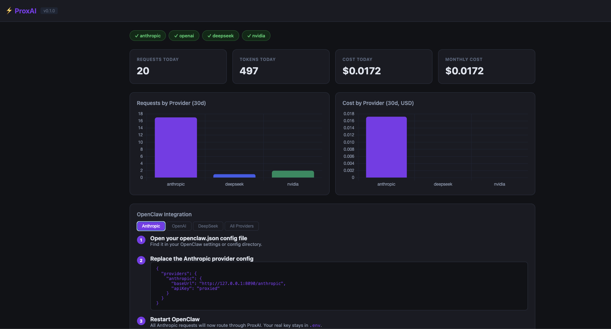

<div align="center">

# ⚡ ProxAI

**API key proxy gateway for AI providers.**
Keep your real keys out of your AI agent's reach.

[](https://python.org)
[](LICENSE)
[]()

</div>

---



---

## What is ProxAI?

When you run an AI agent (like OpenClaw), it needs API keys to call LLM providers. Normally those keys sit in a config file the agent can read — meaning a jailbreak or prompt injection could expose them.

**ProxAI fixes that.** It sits between your agent and the providers, injecting your real keys from a secure `.env` file. Your agent only ever sees a dummy value.

```
Your Agent                  ProxAI                     Anthropic / OpenAI
──────────                  ──────                     ──────────────────
POST /anthropic/v1/messages
  apiKey: "proxied"   ──►   strips dummy key
                            injects real key     ──►   api.anthropic.com
                            streams response     ◄──
                      ◄──   logs tokens + cost
```

## Features

- 🔐 **Key isolation** — agents never see real API keys
- 🔄 **Full streaming** — SSE streaming works transparently
- 📊 **Dashboard** — live usage stats, token counts, cost tracking
- 🧪 **Playground** — test any model directly from the dashboard UI
- 🚦 **Rate limiting** — per-provider request throttling
- 🐳 **Docker ready** — one command to run
- 🔌 **Custom providers** — supports any OpenAI-compatible endpoint (Ollama, Groq, Together AI, etc.)

---

## Quick Start

### Docker (recommended)

```bash
git clone https://github.com/HuyNguyenUTA/proxai
cd proxai
cp .env.example .env
nano .env          # add your real API keys

docker compose up -d
```

### pip

```bash
pip install proxai
cp .env.example .env
nano .env

proxai start           # foreground
proxai start --daemon  # background
```

### From source

```bash
git clone https://github.com/HuyNguyenUTA/proxai
cd proxai
python3.10 -m pip install -e .
cp .env.example .env
nano .env

python3.10 -m proxai.cli start --daemon
```

Once running:
- **Proxy** → `http://localhost:8090`
- **Dashboard** → `http://localhost:8091`

---

## OpenClaw Integration

Open your `openclaw.json` and point providers at ProxAI:

```json
{
  "providers": {
    "anthropic": {
      "baseUrl": "http://127.0.0.1:8090/anthropic",
      "apiKey": "proxied"
    },
    "openai": {
      "baseUrl": "http://127.0.0.1:8090/openai",
      "apiKey": "proxied"
    },
    "deepseek": {
      "baseUrl": "http://127.0.0.1:8090/deepseek",
      "apiKey": "proxied",
      "api": "openai-completions"
    }
  }
}
```

> Step-by-step instructions with copy buttons are also available in the dashboard at `http://localhost:8091`.

---

## Supported Providers

| Provider | Proxy Route | Upstream |
|----------|-------------|----------|
| Anthropic | `/anthropic/*` | `api.anthropic.com` |
| OpenAI | `/openai/*` | `api.openai.com/v1` |
| DeepSeek | `/deepseek/*` | `api.deepseek.com/v1` |
| NVIDIA NIM | `/nvidia/*` | `integrate.api.nvidia.com/v1` |
| **Custom** | any OpenAI-compatible URL | Ollama, Groq, Together AI, LM Studio, etc. |

---

## Dashboard

Visit `http://localhost:8091` to see:

- Provider health (which keys are configured)
- Requests, tokens, and cost — today and last 30 days
- Charts by provider
- Recent request log with latency and status codes
- **Playground** — send requests to any model directly from the UI


---

## CLI

```bash
proxai start              # Start proxy (foreground)
proxai start --daemon     # Start in background
proxai stop               # Stop background server
proxai status             # Check if running
proxai logs --tail 100    # View recent logs
proxai stats              # Show usage statistics
```

---

## Configuration

Copy `.env.example` to `.env`:

| Variable | Default | Description |
|----------|---------|-------------|
| `PROXAI_HOST` | `127.0.0.1` | Bind address (`0.0.0.0` for Docker/network) |
| `PROXAI_PORT` | `8090` | Proxy port |
| `PROXAI_LOG_LEVEL` | `INFO` | Log level |
| `PROXAI_RATE_LIMIT_RPM` | `60` | Max requests/min per provider |
| `PROXAI_DASHBOARD_ENABLED` | `true` | Enable web dashboard |
| `PROXAI_DASHBOARD_PORT` | `8091` | Dashboard port |
| `ANTHROPIC_API_KEY` | — | Your Anthropic API key |
| `OPENAI_API_KEY` | — | Your OpenAI API key |
| `DEEPSEEK_API_KEY` | — | Your DeepSeek API key |
| `NVIDIA_API_KEY` | — | Your NVIDIA NIM API key |

---

## Security Model

```
WITHOUT ProxAI:
  openclaw.json → "apiKey": "sk-ant-real-key"   ← agent can read this

WITH ProxAI:
  openclaw.json → "apiKey": "proxied"            ← useless to an attacker
  .env          → ANTHROPIC_API_KEY=sk-ant-...   ← never exposed to agent
```

Even if an attacker gains full control of your AI agent, they cannot extract real API keys — because the agent never has them.

---

## Health Check

```bash
curl http://localhost:8090/health
# {"status":"ok","providers":{"anthropic":true,"openai":true,"deepseek":false,"nvidia":false}}
```

---

## Contributing

PRs welcome! Run the test suite with:

```bash
python3.10 -m pytest tests/ -v
```

---

## License

MIT — see [LICENSE](LICENSE)
